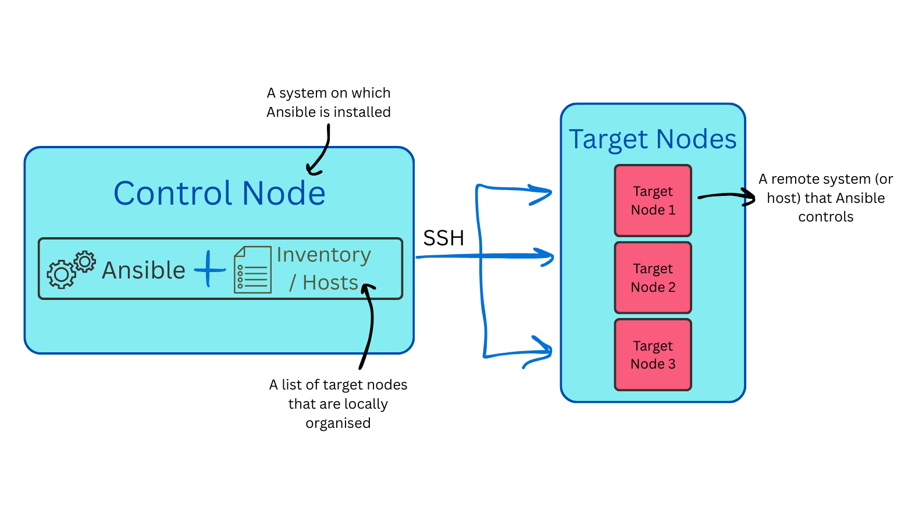

# Infrastructure as Code (IaC)

## What is IaC?

**The ability to provision and support your computing infrastructure using code instead of manual processes and settings.**  
(Any application environment requires many infrastructure components like operating systems, database connections, and storage.)

## What are the benefits of IaC?

- **Consistency** - Avoids configuration drift or human error
- **Scalability** - Easily spin up/down environments (e.g. staging, dev, production)
- **Easy Duplication** - Exact same environment can be deployed on a different system and in a different location quickly
- **Cost Efficiency** - Spin up resources only when needed, saving money in cloud environments
- **Version Controlled** - Usually a file so can track changes via version control

## How does IaC work?

**IaC describes a system architecture and how it works.** There are 2 different approaches to IaC:

- ### Declarative  

    **You state _WHAT_ you want**  
    Declarative IaC allows a developer to describe resources and settings that make up the end state of a desired system. The IaC solution then creates this system from the infrastructure code. This makes declarative IaC simple to use, as long as the developer knows which components and settings they need to run their application

- ### Imperative  

    **You specify _HOW_ to get there step-by-step**  
    Imperative IaC allows a developer to describe all the steps to set up the resources and get to the desired system and running state. While it isn’t as simple to write imperative IaC as declarative IaC, the imperative approach becomes necessary in complex infrastructure deployments. This is especially true when the order of events is critical.

## What is the role of IaC in DevOps?

A key goal of DevOps is to automate infrastructure tasks across the development process. **You can integrate IaC into CI/CD pipelines; when software goes through its build and release process, the necessary infrastructure changes can be made in tandem.**

DevOps teams use IaC for many purposes:
- Quickly set up complete environments, from development to production
- Help ensure consistently reproducible configurations between environments
- Integrate seamlessly with cloud providers and efficiently scale infrastructure resources up or down based on demand

IaC provides a common language for both developers and operations. Changes can be reviewed in a transparent manner, which fosters better collaboration in a DevOps environment.

## Where to start using IaC?

If it takes 3 days to setup IaC code solution and only saves 5 mins every month, it isn't worth using.
If it takes 1 day to setup IaC code solution but saves 30 mins every day, it is worth using.

## What IaC tools are available?

Some examples of tools:
- Ansible
- Terraform
- AWS CloudFormation

Breaks into two categories, **Configuration Management** and **Orchestration**.

- **Configuration Management**
  - Manages the state and settings of existing systems and software
  - Ensures that servers and applications are correctly configured e.g. installing packages, managing config. files, setting up users
  - *Handles the details inside the machine*
  - e.g. Ansible
  - e.g. installing Nginx on an app

- **Orchestration**
  - Automates the coordination and management of multiple systems or services
  - Deals with provisioning, scaling, dependencies, service startup order and interconnections
  - *Handles how machines and services work together as a system*
  - e.g. Kubernetes, Terraform
  - e.g. building an EC2 instance, VPC, SG

> Analogy: Orchestration builds the house, Config. Management makes it liveable inside

### Ansible

Ansible is an open-source IT automation tool that helps you manage and configure computers, servers, and other devices, often at scale. It allows you to automate tasks like:
  - Installing software
  - Configuring systems
  - Deploying applications
  - Managing network devices

- **Ad hoc** => 1-off commands
- **Playbook** => "recipe" / desired state written in YAML
- **Agentless** - do not need to install the software on each agent node, only on the master node. As long as the master node can communicate to the agents, it will run.

### How Ansible Works

