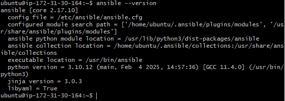
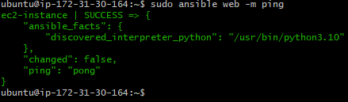
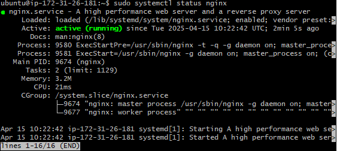

# Ansible Instance Setup

Setting up an Ansible controller and one target node (TN) – allowing the controller to SSH into the target. We'll use the Hosts file to do this.

---

## Controller Instance

- Launch instances
- Name: e.g. `tech503-caleb-ansible-controller`
- Image: **Quick Start** → **Ubuntu 22.04**
- Instance type: `t2.micro`
- Key pair: AWS key
- Network settings: Default  
  - Security group: Any with port 22 (e.g. `app`)
- Launch

---

## Target Node (TN) Instance

- Create instance with the **same settings** as the controller

---

## Setting up Dependencies for Controller

1. **SSH into the controller VM**

    ```bash
    sudo ssh -i ~/.ssh/private-key.pem ubuntu@<controller-ip>
    ```

2. **Run the following commands:**

   ```bash
   python3 --version  # Check Python is installed
   sudo apt update -y  # Update package list
   sudo DEBIAN_FRONTEND=noninteractive apt upgrade -y  # Upgrade packages
   sudo DEBIAN_FRONTEND=noninteractive apt-add-repository ppa:ansible/ansible  # Add Ansible PPA
   sudo DEBIAN_FRONTEND=noninteractive apt install ansible -y  # Install Ansible
   ansible --version  # Verify Ansible installation
   ```

    - If the ansible installation has been successful, you will see a message like this in your terminal:  
   

   > **Note:** You’ll need to press `Enter` for the repository command to work interactively. To automate this, consider using `yes "" | sudo apt-add-repository ...`.

3. **Give controller SSH access to the target node:**

   ```bash
   cd /etc/ansible
   ls  # Verify files
   cd ~
   ls -a
   cd .ssh
   sudo nano private-key.pem  # Paste your private key here
   ```

   - Copy your private key file from your local machine to this file
   - Save and exit

4. **Change the permissions on your Private Key file**

    ```bash
    sudo chmod 400 private-key.pem # Allows only Read permissions for the owner
    ```
   
5. **Manually SSH into the target node from the controller to verify it works**

   ```bash
   sudo ssh -i ~/.ssh/private-key.pem ubuntu@<target-node-ip>
   ```

   - Exit the Target Node once you have verified you can connect to it

6. **Configure Ansible Hosts File:**

   ```bash
   sudo nano /etc/ansible/hosts
   ```

   - Add the following:

     ```ini
     [web]
     ec2-instance ansible_host=<placeholder-ip> ansible_user=ubuntu ansible_ssh_private_key_file=/home/ubuntu/.ssh/<placeholder-key-name>
     ```

7. **Test connection with ping:**

   ```bash
   sudo ansible all -m ping
   ```

   - If it has been successful you will see this in your terminal:  
      

8. **Optional: Suppress warning messages by editing config:**

   ```bash
   sudo nano /etc/ansible/ansible.cfg
   ```

   - Add:

     ```ini
     [defaults]
     interpreter_python = auto_silent # Suppresses pink warning text for python interpreter
     host_key_checking = False # Suppresses add to known host check when running ad hoc commands
     ```

---

## Handy Ansible Commands

- View help:
  ```bash
  ansible-inventory --help
  ```

- List hosts:
  ```bash
  ansible-inventory --list
  ```

- Graph hosts:
  ```bash
  ansible-inventory --graph
  ```

- Run an Ad hoc command on all target nodes:
  ```bash
  sudo ansible web -a "command"
  ```

- Better practice with module specified:
  ```bash
  sudo ansible web -m ansible.builtin.command -a "uname -a"
  ```

  - `-m` = module
  - This is safer and more specific

---

## Apt Update & Upgrade Using Ansible

```bash
# sudo apt update using ansible
sudo ansible web -m ansible.builtin.apt -a "update_cache=yes" --become

# sudo apt upgrade using ansible
sudo ansible web -m ansible.builtin.apt -a "upgrade=dist" --become
```

## Copying the private key from Controller to Target Node using ad hoc commands

- Run this command to copy the private key across to the target node:

    ```bash
    sudo ansible web -m ansible.builtin.copy -a "src=/home/ubuntu/.ssh/private-key.pem dest=/home/ubuntu/.ssh/private-key.pem"
    ```

- Verify the command has worked by SSH'ing into the target node and checking the file exists in the target location or using another ad hoc command:

  - Manual:
    ```bash
    sudo ssh -i ~/.ssh/private-key.pem ubuntu@<target-node-ip> #SSH into the target node
    cd .ssh/ # Change to the .ssh directory
    ls # Look for the private key filename
    ```
  
  - Ad hoc:
    ```bash
    sudo ansible web -a "ls ~/.ssh"
    ```

## Deploying Nginx using ad hoc commands

- Run this command to install Nginx on the target node:

    ```bash
    # Install and update the nginx package using --become to run it as the superuser on the target node
    sudo ansible web -m ansible.builtin.apt -a "name=nginx state=present update_cache=yes" --become
    ```

- Verify the installation by connecting to the Target Node via SSH

    ```bash
    sudo ssh -i ~/.ssh/private-key.pem ubuntu@<target-node-ip> #SSH into the target node
    sudo systemctl status nginx # Check the status of nginx
    ```

  - If the installation was successful, you should see this output:  
    

## Ansible Playbook Guide

* Create .yaml playbook file `sudo nano playbook.yaml`
  
* Save the playbook file in `/etc/ansible`
  
* Syntax check the playbook `sudo ansible-playbook --syntax-check playbook.yaml`
  
* Check the playbook `sudo ansible --check playbook.yaml` - like a dry run of the playbook
  
* Run the playbook with `sudo ansible-playbook playbook.yaml`
  
* Add `--become` to the end of the run command if you need superuser access on the target node
